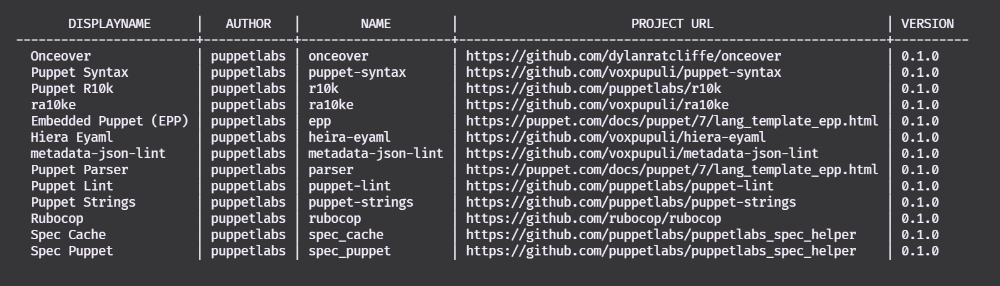

This quick start guide will show you how to:

* Select a Puppet version to run against
* Check for available tools
* Generate reference docs for a Puppet module

It assumes you have already installed PRM.

## Select a Puppet Version

By default, PRM is set to use Puppet 7.0.0 as the runtime environment.
We can verify that:

```sh
prm get puppet
```

```text
4:35PM INF Puppet version is configured to: 7.0.0
```

To change the Puppet runtime version, we use the `prm set` command:

```sh
prm set puppet 6.19.1
```

And then confirm that the correct version has been set:

```sh
prm get puppet
```

```sh
4:36PM INF Puppet version is configured to: 6.19.1
```

From this point on, PRM will be executing in the `6.19.1` Puppet runtime.
For the list of available versions, see the [Puppet Agent docker tag list](https://hub.docker.com/r/puppet/puppet-agent/tags).
In this initial release, the runtime is tied to the published Puppet Agent Docker images.

## Check Available Tools

To see what tools are available by default, we can run a single command:

```sh
prm exec --list
```

Which by default returns a table view of available tools - including their name, author, project url, and version.

<!-- Once committed, this needs to be updated to the github link -->


## Generate Reference Docs

Reviewing the listed tools, we can see that there is a `puppet-strings` tool.
By default, this tool runs the Puppet Strings command to verify the documentation status of the module.
We can point this at a folder containing a Puppet module to see the state of that module's documentation.
In this example, we're generating the reference documentation for the [ACL module](https://forge.puppet.com/puppetlabs/acl).

```sh
prm exec puppetlabs/puppet-strings --codedir ~/code/modules/puppetlabs-acl
```

```text
4:54PM INF Creating new image. Please wait...
4:54PM INF Code path: ~/code/modules/puppetlabs-acl
4:54PM INF Cache path: ~/.pdk/prm/cache
4:54PM INF Additional Args: []
Files:                    5
Modules:                  2 (    0 undocumented)
Classes:                  4 (    0 undocumented)
Constants:               25 (    0 undocumented)
Attributes:               9 (    0 undocumented)
Methods:                 49 (    0 undocumented)
Puppet Data Types:        0 (    0 undocumented)
Puppet Data Type Aliases:     0 (    0 undocumented)
Puppet Classes:           0 (    0 undocumented)
Puppet Types:             1 (    0 undocumented)
Puppet Providers:         1 (    0 undocumented)
Puppet Functions:         0 (    0 undocumented)
Puppet Defined Types:     0 (    0 undocumented)
Puppet Plans:             0 (    0 undocumented)
Puppet Tasks:             0 (    0 undocumented)
 100.00% documented
4:54PM INF Tool puppetlabs/puppet-strings executed successfully
```

Behind the scenes, PRM built a docker container on the fly from the tool definition for `puppet-strings` and then executed it against the specified directory.
The output we see without the PRM log prefix is what the docker container's stdout returned;
in this case, the documentation results for the ACL module.

We can also pass arbitrary arguments to the tool;
to generate the reference documentation, we need to specify that we want to generate the document and set the format to markdown.
This will create (or update if it exists) the `REFERENCE.md` file in the module's folder.

```sh
prm exec puppetlabs/puppet-strings --codedir ~/code/modules/puppetlabs-acl --toolArgs "strings generate --format markdown"
```

```text
4:54PM INF Creating new image. Please wait...
4:54PM INF Code path: ~/code/modules/puppetlabs-acl
4:54PM INF Cache path: ~/.pdk/prm/cache
4:54PM INF Additional Args: [strings generate --format markdown]
Files:                    5
Modules:                  2 (    0 undocumented)
Classes:                  4 (    0 undocumented)
Constants:               25 (    0 undocumented)
Attributes:               9 (    0 undocumented)
Methods:                 49 (    0 undocumented)
Puppet Data Types:        0 (    0 undocumented)
Puppet Data Type Aliases:     0 (    0 undocumented)
Puppet Classes:           0 (    0 undocumented)
Puppet Types:             1 (    0 undocumented)
Puppet Providers:         1 (    0 undocumented)
Puppet Functions:         0 (    0 undocumented)
Puppet Defined Types:     0 (    0 undocumented)
Puppet Plans:             0 (    0 undocumented)
Puppet Tasks:             0 (    0 undocumented)
 100.00% documented
4:54PM INF Tool puppetlabs/puppet-strings executed successfully
```

While the output of Puppet Strings itself isn't any different, we can check the timestamp on the `REFERENCE.md` file and verify that it was just updated (or created if it didn't already exist).

Now you know how to set the Puppet runtime for PRM, find a tool to execute, and execute that tool with additional arguments.
